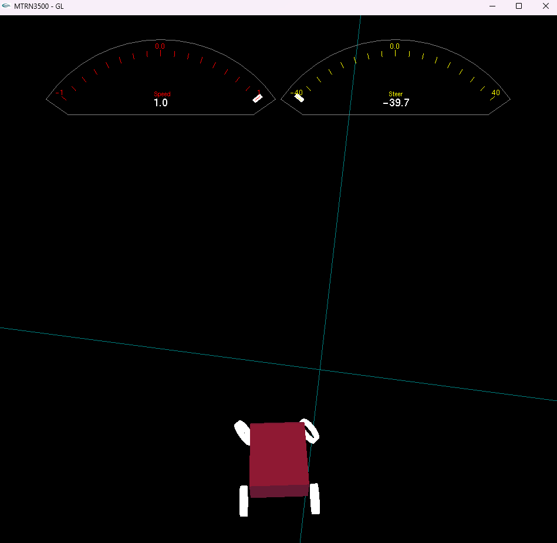

# UGV Backend Control System

## Overview

This project was developed as part of the **MTRN3500 - Computing Applications in Mechatronic Systems** course.
The objective was to implement a robust, modular **backend control system** for a **tele-operated Unmanned Ground Vehicle (UGV)**.
Communication with the UGV was achieved using TCP/IP over a wireless connection.

Was provided with the **frontend visualization and control interface** and tasked with completing the backend based on a detailed set of functional and architectural requirements. The system was first tested using a **UGV simulator** and then validated on the **physical UGV hardware in the lab**.

## Project Goals

- Develop a multi-threaded, object-oriented C++ application using Visual Studio 2022.
- Implement six interdependent software modules (threads) using shared memory and TCP communication.
- Interface with real-time data streams from industrial sensors and an Xbox controller.
- Support seamless operation between simulated and real UGV environments.

## Functional Modules

### 1. Thread Management Module

- Central coordinator for the system.
- Sets up shared memory and spawns all other threads.
- Monitors thread health via heartbeats.
- Handles routine and emergency shutdowns.

### 2. Laser Module

- Connects to the onboard LMS151 laser rangefinder via TCP (`192.168.1.200:23000`).
- Converts polar laser data to Cartesian coordinates.
- Stores results in shared memory for other modules to access.
- Forms a **critical thread** for vehicle navigation.

### 3. GNSS Module

- Interfaces with a GNSS receiver (`192.168.1.200:24000`) over TCP.
- Decodes binary GPS data into UTM (Easting, Northing, Height) and validates with CRC checksum.
- Streams data to shared memory and prints live GNSS values to the terminal.
- Considered a **non-critical thread**, but aids in user orientation.

### 4. Controller Module

- Interfaces with an Xbox controller via a provided C++ class.
- Captures joystick input to determine speed and steering.
- Sends shutdown signal when a specific button is pressed.
- Inputs are published to shared memory and consumed by the Vehicle Control Module.
- A **critical thread** for tele-operation.

### 5. Vehicle Control Module

- Sends ASCII command strings over TCP (`192.168.1.200:25000`) to steer and propel the UGV.
- Formats commands as `# <steer> <speed> <flag> #`, alternating the flag to indicate control activity.
- Reads controller input from shared memory and translates it into motion.
- A **critical thread** enabling direct actuation of the vehicle.

### 6. Display Module

- Publishes sensor data to a TCP interface for live visualization in MATLAB.
- Sends 361-point laser scan arrays as bytes for real-time plotting.
- Provides vital visual feedback for remote driving.
- Another **critical thread**, since it enables user situational awareness.

## Key Features

- **Multi-threading:** Each functional component operates in its own thread for modularity and fault isolation.
- **Heartbeat Monitoring:** Thread Management monitors thread health and performs restarts or shutdowns as needed.
- **Shared Memory:** SMObjects are used for communication and data sharing across threads.
- **Simulator Support:** The system supports switching between real hardware and a simulator by changing the IP address.

### Software and Hardware Requirements

- Visual Studio 2022
- Xbox Controller (optional, supports keyboard fallback)
- MATLAB (for display module)
- UGV simulator (provided)

### Running Instructions

1. Run `Weeder_Simulator`
2. Open Project Solution `UVG_Assignment.sln` using Visual Studio
3. Run and Build the `Main.cpp`

### Switching Between Simulator and Hardware

- **Simulator Mode:** Set `WEEDER_ADDRESS` to `127.0.0.1`
- **Hardware Mode:** Set `WEEDER_ADDRESS` to `192.168.1.200` and connect to the UGV Wi-Fi

## Screenshots

- Controlling the UGV using arrow keys. (right-left arrows - steering, up-down arrows - speed)
  

## Highlights and Learnings

- Gained experience in real-time multi-threaded systems and sensor integration.
- Designed fault-tolerant software using shared memory and watchdog mechanisms.
- Developed proficiency in TCP/IP communication, binary data parsing, and system synchronization.
